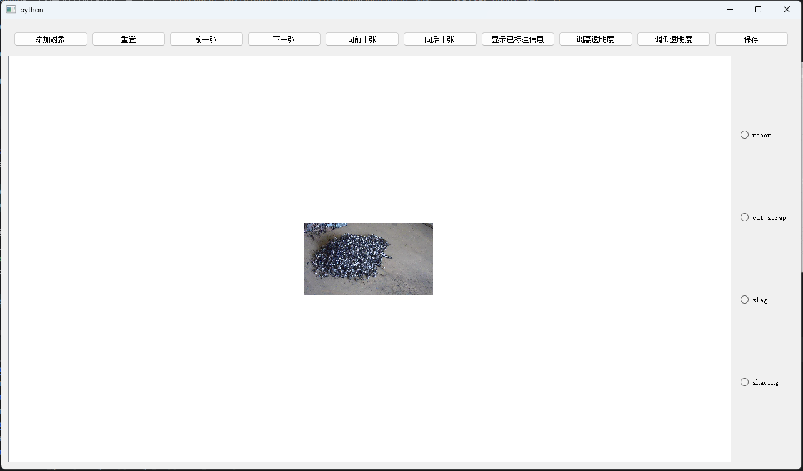
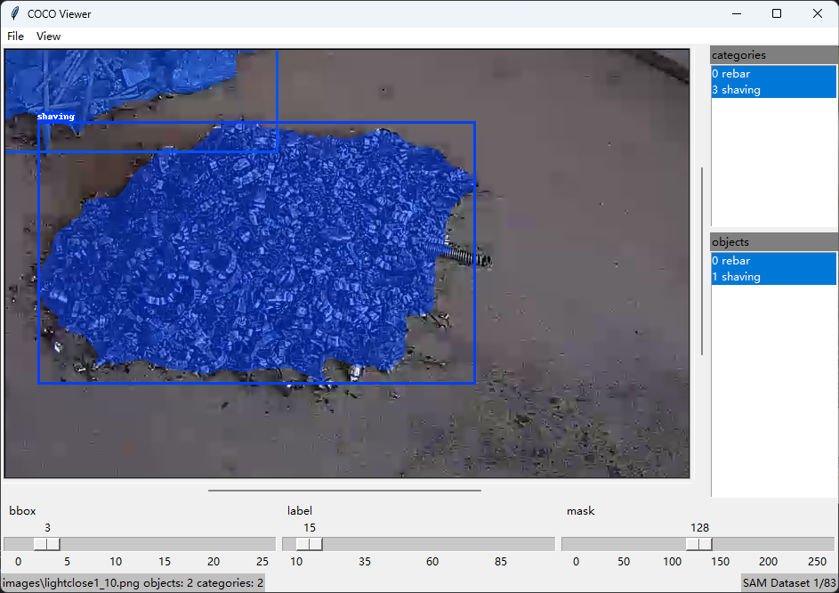

# AutoMaskCOCO

AutoMaskCOCO是一个简单易用的图像分割数据集标注工具，它结合了**Segment Anything**、**COCO Viewer**和**Segment Anything Labelling Tool (SALT)** 三个开源项目的优势，为用户提供了一个自动生成掩码并创建COCO数据集的一站式解决方案。通过这个项目，我们旨在简化图像分割和数据集标注的过程，为计算机视觉研究人员和开发者节省宝贵的时间。

- **Segment Anything**为AutoMaskCOCO提供了灵活的分割和掩码功能。
- **COCO Viewer**项目为AutoMaskCOCO带来了一个直观的界面，方便用户查看和管理COCO数据集，对图像和标注进行有效的检查。
- **Segment Anything Labelling Tool (SALT)** 为AutoMaskCOCO提供了一个用户友好的标注界面，让用户能够轻松地对图像进行分割、标注和编辑。

AutoMaskCOCO项目利用标点自动生成掩码，降低了图像分割数据标注的难度，同时还可以自动输出COCO数据集格式的结果，为计算机视觉任务的数据准备工作提供便利。

## 示例






## 准备工作
1.  克隆相关项目：
```shell
git clone https://github.com/917940234/SAM-Tool.git
git clone https://github.com/facebookresearch/segment-anything.git
```
2.  下载预训练的SAM模型：[sam_vit_h_4b8939.pth](https://dl.fbaipublicfiles.com/segment_anything/sam_vit_h_4b8939.pth) 并将其放入`segment-anything`项目主目录。
3.  准备数据集：将图像放置在`<dataset_path>/images/`中，并在`<dataset_path>`下创建名为`embeddings`的空文件夹。
4.  将`SAM-Tool`项目中的`helpers`文件夹复制到`segment-anything`项目的主目录。
5.  安装环境：
```shell
conda install pytorch==1.12.1 torchvision==0.13.1 torchaudio==0.12.1 cudatoolkit=11.6 -c pytorch -c conda-forge
```

## 提取图像Embeddings
运行`extract_embeddings.py`脚本以提取图像的embeddings：
```shell
python helpers\extract_embeddings.py --checkpoint-path sam_vit_h_4b8939.pth --dataset-folder <dataset_path>
```
参数说明：
-   `checkpoint-path`：预训练SAM模型的路径。
-   `dataset-folder`：数据集路径。
-   `device`：默认为`cuda`，如无GPU，可使用`cpu`（速度较慢）。
运行完成后，`<dataset_path>/embeddings`文件夹下会生成相应的npy文件。

## 转换模型格式
使用`generate_onnx.py`脚本将`.pth`文件转换为`.onnx`模型文件：
```shell
python helpers\generate_onnx.py --checkpoint-path sam_vit_h_4b8939.pth --onnx-model-path ./sam_onnx.onnx --orig-im-size 1080 1920
```
参数说明：
-   `checkpoint-path`：预训练SAM模型的路径。
-   `onnx-model-path`：导出的`.onnx`模型保存路径。
-   `orig-im-size`：数据集中图像的尺寸（height, width）。
**注意：** 生成的`.onnx`模型不支持动态输入大小。如果数据集中的图像尺寸不一致，可以使用不同的`orig-im-size`参数导出多个`.onnx`模型供后续使用。

## 标注图像
将生成的`sam_onnx.onnx`模型复制到`SAM-Tool`项目主目录，然后运行`segment_anything_annotator.py`进行标注：
```shell
python segment_anything_annotator.py --onnx-model-path sam_onnx.onnx --dataset-path <dataset_path> --categories cat,dog
```
参数说明：
-   `onnx-model-path`：导出的`.onnx`模型路径。
-   `dataset-path`：数据集路径。
-   `categories`：数据集的类别（每个类别以`,`分割，不要有空格）。
在对象位置点击鼠标左键添加掩码，点击右键去掉该位置掩码。最后生成的标注文件为COCO格式，保存在`<dataset_path>/annotations.json`。

## 查看标注结果
在`SAM-Tool`项目中运行`cocoviewer.py`查看全部的标注结果：
```shell
python cocoviewer.py -i <dataset_path> -a <dataset_path>\annotations.json
```

## 自定义设置
1.  修改标注框线条宽度： 在`salt/display_utils.py`中，找到`class DisplayUtils`，修改`self.box_width`的值。
2.  修改标注文本格式： 在`salt/display_utils.py`中，找到`def draw_box_on_image`函数，修改`text`、`txt_color`、`font`等参数。
3.  标注快捷键：
    -   `Esc`：退出app
    -   `a`：前一张图片
    -   `d`：后一张图片
    -   `a`：前十张图片
    -   `d`：后十张图片
    -   `k`：调低透明度
    -   `l`：调高透明度
    -   `n`：添加对象
    -   `r`：重置
    -   `Ctrl+s`：保存之前的操作
    -   `Ctrl+z`：撤销对象

通过以上步骤，可以使用SAM标注工具为您的图像数据集生成COCO格式的标注。如有需要，可以根据自己的需求调整设置以优化标注过程。
